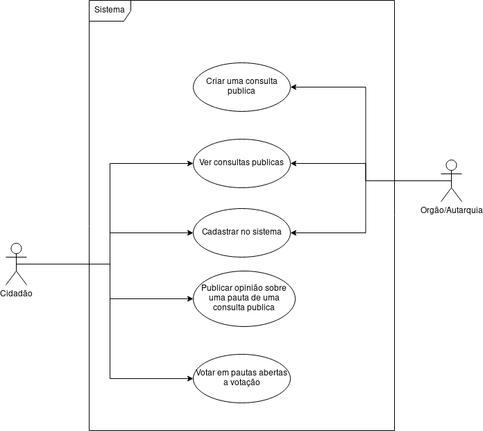

## Requisitos

- Python 3.11
- NodeJS 18

## Bibliotecas Utilizadas

#### Backend
- FastAPI
- SQLAlchemy

#### Frontend
- ReactJS
- react-router-dom
- Axios HTTP
- Font Awesome

## Instruções 

### Backend
```
cd api                              # entrar no diretorio do backend

python -m venv venv                 # criar um ambiente virtual python

venv\Scripts\activate               # ativar o ambiente virtual python
                                    # no powershell use "venv\Scripts\Activate.ps1"


pip install -r requirements.txt     # instalar dependencias

python main.py                      # iniciar o backend
```

### Frontend
```
cd app                              # entrar no diretorio do frontend

npm install                         # instalar as dependencias

npm start                           # iniciar o backend
```
### A aplicação estará disponível em http://localhost:1776


## Diagrama de caso de uso


